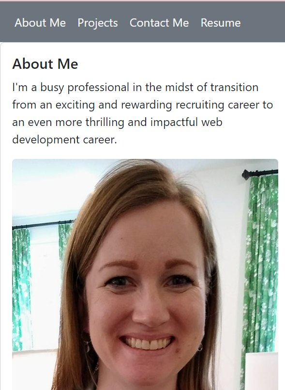

  # React Portfolio 
  
  ## Description
  
  This project is a remake of my personal portfolio using my new React skills. It is a single-page application showcasing my work samples, resume, and contact information.
  
  ## Table of Contents
  
  * [Installation](#installation)
  * [Usage](#usage)
  * [License](#license)
  * [Contribution Guidelines](#contributions)
  * [Questions](#questions)
  
  ## Installation
  
  N/A
  
  ## Usage
  
  URL

  
  
  ## License
    
  This project uses the MIT license
    
  
  ## Contributions
  
  N/A
  
  ## Questions
  This project was created by [lindseycarlson23](https://github.com/lindseycarlson23)
  Send me an email here: lindseycarlson23@gmail.com
  